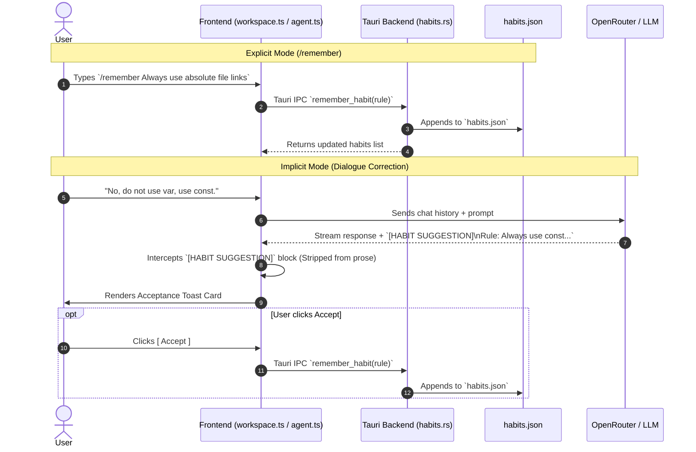

# Prism Habit & Learning Module: Implementation Plan

```text path=null start=null
┌─────────────────────────┐       ┌───────────────────────────┐
│ User: /remember <rule>  │──────►│                           │
└─────────────────────────┘       │                           │
                                  │   habits.json (Storage)   │
┌─────────────────────────┐       │                           │
│ Agent: Suggests Habit   │──────►│                           │
└─────────────────────────┘       └───────────────────────────┘
   │                                            ▲
   ▼ (Intercepted by Parser)                    │ (One-Click)
┌─────────────────────────┐                     │
│ UI Toast: [Accept]      │─────────────────────┘
└─────────────────────────┘
```

## 1. Architectural Philosophy & Core Constraints

Prism is built around a deterministic substrate layer and strict confidence grading. A learning module must not introduce non-deterministic model drift, prompt bloat, or opaque vector databases.

### Core Goals
1. **Strict User Agency:** Prism learns what the user commands (`/remember`) or explicitly approves (`Accept` toast).
2. **Transparent Storage:** Habits live in clean, version-controllable JSON (`habits.json`).
3. **Narrow Prompt Injection:** Habits are injected directly into the consumer system prompt alongside substrate discipline rules.

---

## 2. System Architecture & Dual-Mechanism Loop



---

## 3. Data Storage & Backend State Schema

### 3.1 File Storage (`habits.json`)
Located globally under `~/.config/prism/habits.json` (or locally under `.prism/habits.json` for project-scoped overrides).

```json
{
  "schema_version": 1,
  "last_updated": "2026-05-14T12:00:00Z",
  "rules": [
    {
      "id": "hbt_01",
      "rule": "Prefer async/await over raw Promise chains.",
      "source": "manual",
      "created_at": "2026-05-14T10:15:00Z"
    },
    {
      "id": "hbt_02",
      "rule": "Always use absolute file URIs when creating markdown links.",
      "source": "suggested",
      "created_at": "2026-05-14T11:22:00Z"
    }
  ]
}
```

### 3.2 Tauri Backend State (`src-tauri/src/habits.rs`)
Manages concurrent, atomic reads/writes to `habits.json`.

```rust
use serde::{Deserialize, Serialize};
use std::sync::Arc;
use tokio::sync::RwLock;

#[derive(Debug, Clone, Serialize, Deserialize)]
pub struct HabitRule {
    pub id: String,
    pub rule: String,
    pub source: String, // "manual" | "suggested"
    pub created_at: String,
}

#[derive(Debug, Clone, Serialize, Deserialize)]
pub struct HabitsStore {
    pub schema_version: u32,
    pub last_updated: String,
    pub rules: Vec<HabitRule>,
}

pub struct HabitsState(pub Arc<RwLock<HabitsStore>>);
```

---

## 4. Backend Implementation Plan

### 4.1 Tauri IPC Commands (`src-tauri/src/habits.rs`)
Implement and expose three entry points:
- `get_habits`: Returns the current list of habits.
- `remember_habit(rule: String, source: String)`: Generates an ID, appends to store, performs atomic write.
- `delete_habit(id: String)`: Prunes a habit by ID.

Register these commands in `src-tauri/src/main.rs`.

### 4.2 System Prompt Framing (`src-tauri/src/agent.rs`)
In `build_system_prompt()`, inject the active habits right before the output framing contract:

```rust
pub async fn build_system_prompt(state: &AppState) -> String {
    let mut prompt = String::from(BASE_PROMPT);
    
    // Inject Habits
    let habits_lock = state.habits.0.read().await;
    if !habits_lock.rules.is_empty() {
        prompt.push_str("\n\n## User Preferences & Habits\n");
        prompt.push_str("You must strictly abide by these established user habits when writing or refactoring code:\n");
        for h in &habits_lock.rules {
            prompt.push_str(&format!("- {}\n", h.rule));
        }
    }
    
    prompt
}
```

---

## 5. Frontend Implementation Plan

### 5.1 Slash Command (`src/slash-commands.ts` & `src/workspace.ts`)
Register `/remember`:

```ts
export const slashCommands = [
  // ...
  {
    name: "remember",
    description: "Teach Prism a coding habit or style preference",
    usage: "/remember <rule>",
  },
];
```

In `workspace.ts` slash handler:
```ts
if (cmd === "remember") {
  await invoke("remember_habit", { rule: args, source: "manual" });
  appendNotice(`[Habit Recorded] ${args}`);
  return;
}
```

### 5.2 Stream Interception & UI Toast (`src/agent.ts`)
Extend the streaming parser to catch `[HABIT SUGGESTION]` blocks:

```ts
// Regex matching: [HABIT SUGGESTION]\nRule: <text>\nReason: <text>
const HABIT_REGEX = /\[HABIT SUGGESTION\]\s*\nRule:\s*([^\n]+)\s*\nReason:\s*([^\n]+)/i;

function parseAgentChunk(chunk: string) {
  const match = chunk.match(HABIT_REGEX);
  if (match) {
    const rule = match[1].trim();
    const reason = match[2].trim();
    
    // Strip from user-facing prose
    chunk = chunk.replace(HABIT_REGEX, "");
    
    // Render Toast Card
    renderHabitToast(rule, reason);
  }
  return chunk;
}

function renderHabitToast(rule: string, reason: string) {
  const container = document.createElement("div");
  container.className = "agent-habit-toast";
  container.innerHTML = `
    <div class="toast-head">✨ New Habit Noticed</div>
    <div class="toast-rule">${rule}</div>
    <div class="toast-reason">${reason}</div>
    <div class="toast-actions">
      <button class="toast-btn accept">Accept</button>
      <button class="toast-btn dismiss">Dismiss</button>
    </div>
  `;
  
  container.querySelector(".accept")?.addEventListener("click", async () => {
    await invoke("remember_habit", { rule, source: "suggested" });
    container.remove();
    appendNotice(`[Habit Accepted] ${rule}`);
  });
  
  container.querySelector(".dismiss")?.addEventListener("click", () => {
    container.remove();
  });
  
  document.querySelector(".agent-stage")?.appendChild(container);
}
```

---

## 6. CSS Styling (`src/styles.css`)

```css
.agent-habit-toast {
  margin: 12px 16px;
  padding: 12px 16px;
  background: rgba(13, 15, 20, 0.85);
  backdrop-filter: blur(12px);
  border: 1px solid rgba(125, 211, 252, 0.3);
  border-left: 3px solid #7dd3fc;
  border-radius: 8px;
  box-shadow: 0 8px 32px rgba(0, 0, 0, 0.4);
  animation: slide-up 200ms ease-out;
}

.toast-head {
  font-size: 11px;
  font-weight: 700;
  text-transform: uppercase;
  letter-spacing: 0.05em;
  color: #7dd3fc;
  margin-bottom: 4px;
}

.toast-rule {
  font-size: 13px;
  font-weight: 600;
  color: #f3f4f6;
  margin-bottom: 4px;
}

.toast-reason {
  font-size: 11px;
  color: #9ca3af;
  margin-bottom: 10px;
  font-style: italic;
}

.toast-actions {
  display: flex;
  gap: 8px;
}

.toast-btn {
  padding: 4px 12px;
  font-size: 11px;
  font-weight: 600;
  border-radius: 4px;
  cursor: pointer;
  transition: all 150ms ease;
}

.toast-btn.accept {
  background: rgba(125, 211, 252, 0.15);
  border: 1px solid rgba(125, 211, 252, 0.4);
  color: #7dd3fc;
}
.toast-btn.accept:hover {
  background: rgba(125, 211, 252, 0.25);
  border-color: #7dd3fc;
  color: #bae6fd;
}

.toast-btn.dismiss {
  background: transparent;
  border: 1px solid #374151;
  color: #9ca3af;
}
.toast-btn.dismiss:hover {
  background: rgba(55, 65, 81, 0.4);
  color: #d1d5db;
}

@keyframes slide-up {
  from { opacity: 0; transform: translateY(10px); }
  to { opacity: 1; transform: translateY(0); }
}
```

---

## 7. Testing & Prompt Discipline Verification

1. **Rust Unit Tests (`habits_tests.rs`):** Verify atomic file locking, JSON serialization, and ID generation.
2. **Prompt Contract Tests (`agent::prompt_tests`):** Assert that when habits exist in state, they are correctly formatted under `## User Preferences & Habits`.
3. **Stream Interception Tests:** Validate that `parseAgentChunk` correctly removes `[HABIT SUGGESTION]` from dialogue prose and triggers DOM toast creation.
